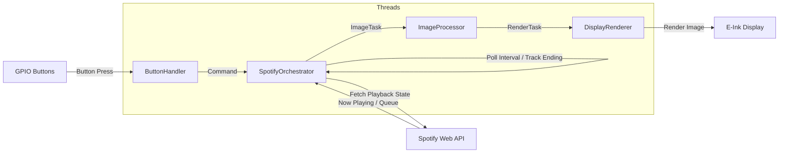

# E-Ink UI

A simple Spotify "now playing" UI for a 7.3" 6-colour e-ink display.
Designed for use with a Raspberry Pi

Features
- Spotify now playing info
- Album art
- Dynamic colour scheme based on album art
- Media control (play/pause, next track, previous track, save to favourites)

## How it works

### Architecture rationale

This project originally used a single-threaded design in which Spotify polling, image generation, and display 
rendering were handled sequentially. In practice, this proved unsuitable for the target hardware and workload 
due to two blocking operations:

1. **Image generation cost**. UI background colour selection uses a K-means clustering algorithm, which is 
    computationally expensive on a Raspberry Pi.

2. **E-ink display latency**: A full e-ink refresh takes approximately 12–20 seconds and blocks while rendering. 
    If the user skips tracks during this period, subsequent updates are delayed further.

To address these issues, the project was re-architected to use a threaded producer/consumer design.
Responsibilities are split across dedicated threads for input handling, Spotify state management, image processing, 
and display rendering. 
This allows the system to look ahead at the playback queue and pre-render UI screens asynchronously, decoupling 
expensive computation and slow I/O from real-time playback changes.

As a result, UI images for upcoming tracks are typically ready before they are needed, allowing the display to update 
almost immediately when a track changes.

### Architecture diagram



## Installation

Create a `.env` file with the following variables:

```dotenv
SPOTIPY_CLIENT_ID=
SPOTIPY_CLIENT_SECRET=
```

## Setup

For setup on a fresh Raspberry Pi Lite OS installation, use the following commands:

### Add non-root user

```bash
sudo adduser einkui
sudo usermod -aG sudo einkui
sudo usermod -aG gpio einkui
sudo usermod -aG spi einkui
su einkui
```

### Clone and install

```bash
apt install python3-dev
git clone https://git.coombe.xyz/coomb/eink-ui.git
cd eink-ui
source venv/bin/activate
pip3 install -r requirements.txt
python3 main.py
```
